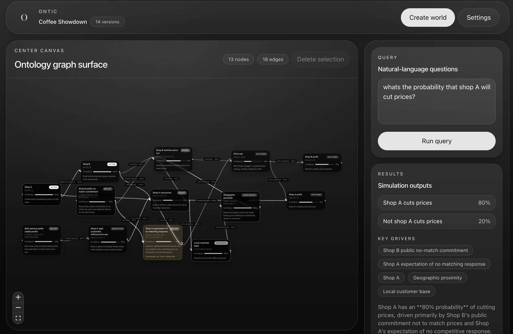
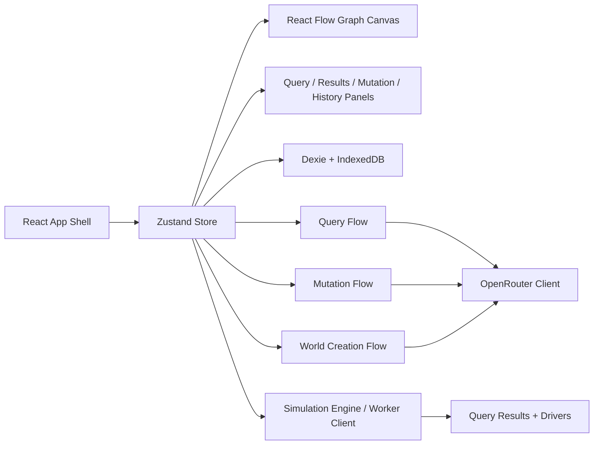

# Ontic


Ontic is a browser-first, local-first ontology and simulation tool for modeling a situation, asking questions about it, and mutating world state over time.

## Screenshot



## What It Does

- Turn a scenario into a structured ontology graph.
- Ask natural-language questions against the current world state.
- Apply interventions as versioned mutations.
- Compare snapshots and probability shifts over time.
- Persist worlds, history, and settings locally in the browser.

## Architecture



## Stack

- React
- TypeScript
- Vite
- Tailwind CSS
- Zustand
- Dexie / IndexedDB
- React Flow
- Zod

## Local Setup

```bash
pnpm install
pnpm dev
```

## Commands

```bash
pnpm dev
pnpm build
pnpm lint
pnpm test
pnpm preview
```

## Notes

- This app is local-first. Worlds and settings are stored in the browser.
- OpenRouter is used for parsing, repair, and explanation flows.
- Product and implementation intent live in [SPEC.md](/Users/johnleonardo/Documents/ontic/docs/SPEC.md) and [DESIGN.md](/Users/johnleonardo/Documents/ontic/docs/DESIGN.md).
